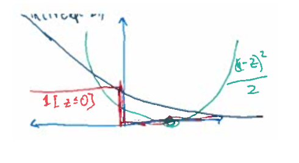
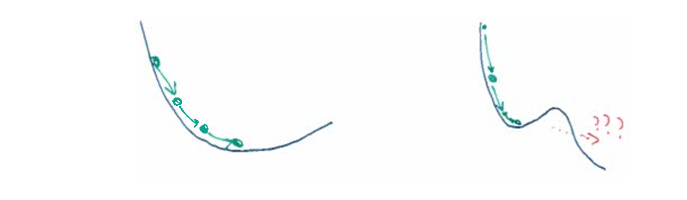
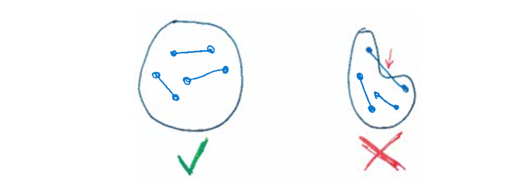
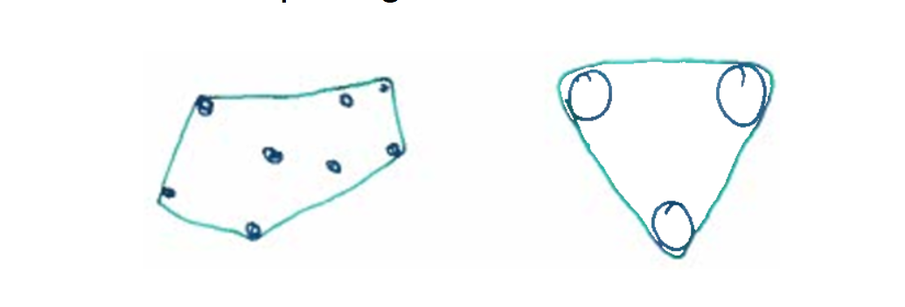
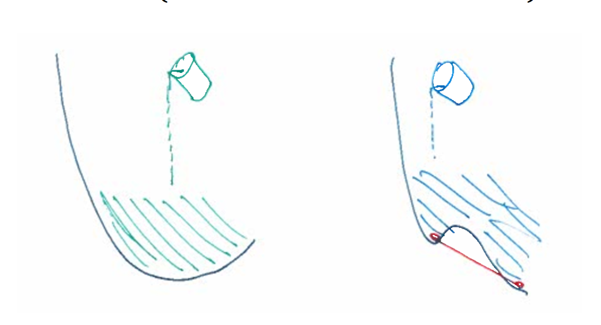
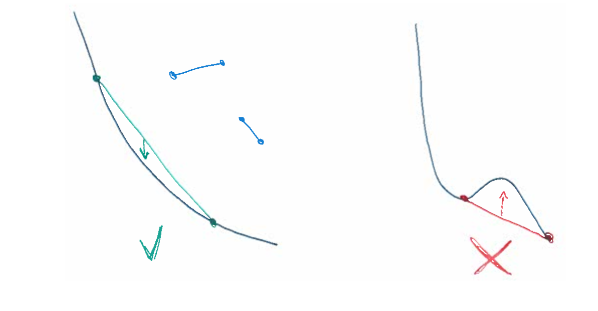

# CS 446 Machine Learning Lecture 4

## Linear Classification

Suppose $y^{(i)} \in \{-1, +1\}$

__ERM (Emperical Risk Minimization)__ for linear classification:
$$
arg \min\limits_{w \in \mathbb{R}^d} \frac{1}{n} \sum_{i=1}^{n}l(y^{(i)}w^Tx^{(i)})
$$
or 
$$
arg \min\limits_{w \in \mathbb{R}^d} \frac{1}{n} \sum_{i=1}^{n}l(y^{(i)}w^T\phi(x^{(i)}))
$$

where $\phi$ is a feature transformer 

There are some choices of the lost $l$

- $z \rightarrow 1[z \leq 0]$   zero-one/classification
- $z \rightarrow \frac{1}{2}(1 -z)^2$  Least squares/linear regression
- $z \rightarrow ln(1 + exp(-z))$  Logisitic regression

### Gradient decent

How to solve for **weights** $w \in \mathbb{R}^d$ in  
$$
arg \min\limits{w \in \mathbb{R}^d} \frac{1}{n} \sum{i=1}{n}l(y{(i)}wTx{(i)})
$$

Linear and logisictic regression have no "bumps" (convex)

Neural nets are not linear models, but still have **weights**:
$$
arg \min\limits_{w \in \mathbb{R}^d} \frac{1}{n} \sum_{i=1}^{n}l(y^{(i)}w^Tx^{(i)})   \text{   Linear predictor}
$$

$$
arg \min\limits_{w \in \mathbb{R}^p} \frac{1}{n} \sum_{i=1}^{n}l(y^{(i)}f_w(x^{(i)})) \text{  Neural Network}
$$

Do we encounter "bumps" in Neural Nets? _unknown_

## Convexity 

A set is **convex** if it contains all line segments:

$C \subseteq \mathbb{R}^d$ is convex when 
$$
\{x, y\} \subseteq C \implies [x,y] \subseteq C
$$
where $[x,y] = \{\alpha x + (1-\alpha)y : \alpha \in [0,1]\}$

**Convex Hull** encircles data $\implies$ intersection of all convex supersets!

Alternatively (fo finite set $S = (x_1, … x_k)$):

all **convex combinations**: 
$$
conv(s) := \big\{ \sum_{i=1}^{k}\alpha_ix_i : \alpha_i \geq 0, \sum_{i=1}^{k}\alpha_i = 1\big\}
$$
Convex hull is the intersection of all convex supersets.

### Convex Functions

Bucket fill a function from above (known as an epigraph)
$$
epi(f) := \{(x,r) : x \in \mathbb{R}^d, r \in \mathbb{R}, f(x) \leq r\}
$$

$f$ is a **convex function** when $epi(f)$ is a convex set.
$$
\text{For any } x,y \in \mathbb{R}^d, \alpha \in [0,1], \\
f(\alpha x + (1-\alpha) y) \leq \alpha f(x) + (1 - \alpha) f(y)
$$

### Checking for Convexity 

- **Function values**: $\forall x, y, \forall \alpha \in [0,1]$

$$
f(\alpha x + ( 1- \alpha) y) \leq \alpha f(x) + (1 - \alpha) f(y)
$$

- **Deriviatives**: $\forall x, y$, 
  $$
  f(y) \leq f(x) + \nabla f(x)^T(y-x)
  $$
  ​	(This imples increasing slopes: $(\nabla f(y) - \nabla f(x))^T(y - x ) \geq 0$

- **Hessians**: $\forall x$,
  $$
  \nabla^2f(x) \succeq  0
  $$

_note_:$ M  \succeq  0 \implies $ All eigenvalues large than 0

### Strict Convexity 

